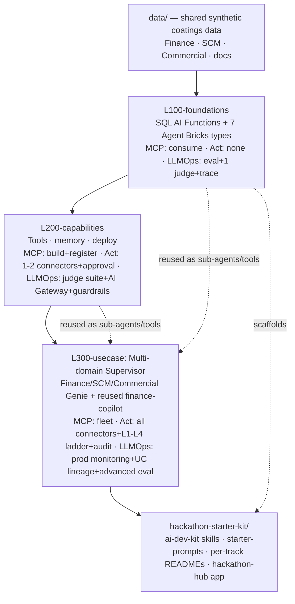
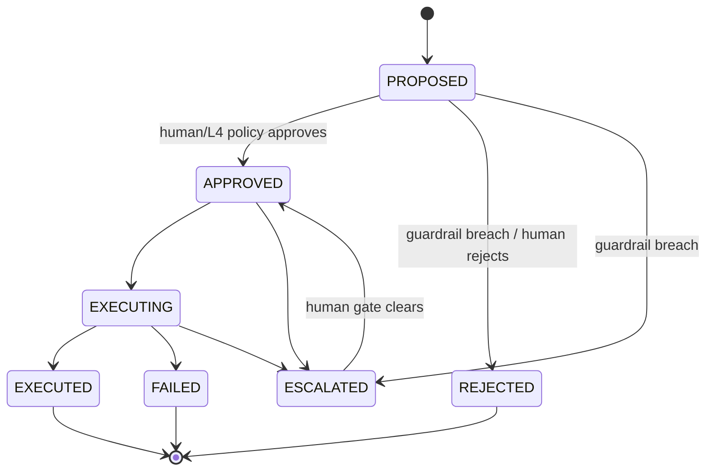

# Master Plan: AkzoNobel Agent Bricks Workshop — Progressive L100→L300 Ladder

**Type:** refactor (reposition) + feat (new modules)
**Created:** 2026-06-29
**Status:** Approved scope, ready for build
**Target repo:** `akzonobel-agentbricks-workshop` (this repo)

---

## Summary

Reposition the AkzoNobel Agent Bricks workshop into the progressive **L100 → L200 → L300** ladder pioneered by `AnanyaDBJ/databricks-ai-workshops`, pouring in the use-case content, `action_plane` (agents-that-act), AppKit hackathon hub, and AkzoNobel theme from `Praneeth16/akzo-agent-bricks-workshop`.

The workshop teaches **all 7 Agent Bricks agent types** and the **SQL AI Functions** surface from the ground up, with three capabilities deepening tier-over-tier as parallel spines:

- **MCP** — consume (L100) → build & register (L200) → full fleet (L300)
- **Agents-that-act** — none (L100) → 1–2 connectors + human approval (L200) → all connectors + L1–L4 approval ladder + audit (L300)
- **LLMOps** — MLflow eval + 1 judge + tracing (L100) → judge suite + AI Gateway + guardrails (L200) → production monitoring + UC lineage + advanced eval (L300)

L300 culminates in the flagship **Multi-domain supervisor** (Finance / SCM / Commercial Genie spaces) that reuses the already-built `finance-copilot` as a sub-agent. A separate **`hackathon-starter-kit/`** folder ships ai-dev-kit skills, starter prompts, per-track READMEs (top-8 use cases + doc-extraction cluster), and the existing AppKit hackathon hub.

---

## Problem Frame

The workshop content has grown in N directions: a use-case-app repo (`finance-copilot`, `action-center`, `hackathon-hub`) plus many overlapping plan docs, with no single progressive learning path. Meanwhile Ananya's repo has a clean, proven pedagogical ladder (`simple/` → `medium/` → `advanced/` + shared `data/`) but generic FreshMart content.

We want the **best of both**: Ananya's ladder shape and LLMOps rigor, carrying AkzoNobel's real use cases, theme, and agents-that-act capability. The result must teach the actual Databricks Agent Bricks product surface (the 7 create-agent types and SQL AI functions), not just hand-coded agents, and end in a flagship build drawn from Malvika's preferred use-case list, followed by a hackathon kit teams can fork.

---

## Requirements

| ID | Requirement |
|----|-------------|
| R1 | Restructure this repo into Ananya's ladder: `L100-foundations/`, `L200-capabilities/`, `L300-usecase/`, shared `data/`, AkzoNobel-themed. Each level self-contained and runnable. |
| R2 | Teach all 7 Agent Bricks agent types across the ladder: Supervisor, Genie Space, Knowledge Assistant, Information Extraction (`ai_extract`), Document Parsing (`ai_parse_document`), Text Classification (`ai_classify`), Code-your-own. |
| R3 | Add a SQL AI Functions module in L100: `ai_query`, `ai_forecast`, `ai_summarize`, `ai_mask`, plus the task functions feeding the agent types. |
| R4 | Weave MCP across tiers: L100 consume one read-only tool → L200 build & register an MCP server → L300 wire the full fleet. |
| R5 | Weave agents-that-act via `action_plane`: L100 none → L200 1–2 connectors with guardrails + human approval → L300 all connectors + L1–L4 approval ladder + audit trail. |
| R6 | Make LLMOps a deepening spine across all tiers: MLflow eval + LLM judges, tracing, production monitoring, UC governance, AI Gateway. |
| R7 | L300 flagship = Multi-domain supervisor routing to Finance / SCM / Commercial Genie spaces, reusing the existing `finance-copilot` as the Finance sub-agent. |
| R8 | Separate `hackathon-starter-kit/` with ai-dev-kit `.claude/skills/`, starter prompts, per-track READMEs (top-8 from `USECASES.md` + doc-extraction cluster #15–18), and the existing AppKit hackathon hub. |
| R9 | Every level ships a `WORKSHOP_INSTRUCTIONS.md` / `LAB_GUIDE.md` and architecture diagram so it stands alone. |

Each level follows the lifecycle Ananya's repo already enforces: **Build → Evaluate → Govern → Deploy → Improve.**

---

## Key Technical Decisions

**KTD1 — Adopt Ananya's ladder shape verbatim, rename for clarity.** Use `L100-foundations/`, `L200-capabilities/`, `L300-usecase/` instead of `simple/medium/advanced`. The directory skeleton per level (`.claude/skills/`, `AGENTS.md`, `CLAUDE.md`, `README.md`, `WORKSHOP_INSTRUCTIONS.md`, architecture `.png`, `agent_server/`, `scripts/`, `databricks.yml`, `app.yaml`) is copied from Ananya and re-themed. Rationale: proven pedagogy, less invention, faster build.

**KTD2 — L100 is no/low-code first; code-your-own is the escape hatch.** L100 leads with SQL AI Functions (pure SQL, lowest barrier) and the managed Agent Bricks types (UI-driven), mirroring Ananya's L100 which already teaches Genie, Vector Search, AI Gateway, Knowledge Assistant, Supervisor, and Document Intelligence. The LangGraph coded agent — `create_react_agent` + one managed MCP tool, wrapped as an MLflow `ResponsesAgent` — comes last in L100 as the bridge to L200. Rationale: teach the product surface, not just code.

**KTD3 — L300 supervisor composes prior tiers rather than rebuilding.** The supervisor wires the L100 Knowledge Assistant + extraction/classify agents and the L200 coded agents as sub-agents/MCP tools, and reuses `finance-copilot/backend/agent.py` as the Finance sub-agent. Rationale: matches the product's own description ("combines Genie Spaces, other agents, and MCP tools") and reuses built work (Malvika #1 feeds Malvika #3).

**KTD4 — `action_plane` is the single agents-that-act substrate, introduced once and deepened.** Port `apps/_shared/action_plane/` (the `ActionPlane` 7-state machine: `PROPOSED → APPROVED → EXECUTING → EXECUTED`, with `REJECTED/FAILED/ESCALATED`; the `evaluate()` guardrail engine; the `level` L1–L4 maturity tier). L200 uses it with 1–2 connectors and `requires_approval=true`; L300 uses all connectors with the full L1–L4 autonomy ladder, escalation, and `action_events` audit log. Rationale: one mental model, escalating autonomy is the teaching arc.

**KTD5 — `ai_forecast` anchors the forecast-planner track; `ai_mask` doubles as a governance lesson.** SQL AI functions are not just L100 toys — `ai_forecast` directly implements Malvika's forecast-planner use case, and `ai_mask` is taught as PII governance, feeding the LLMOps spine. Rationale: connect the simplest surface to the real use cases.

**KTD6 — Keep the existing AppKit hackathon hub as-is, relocate under the starter kit.** Move `apps/hackathon-hub/akzo-hackathon-hub/` into `hackathon-starter-kit/hackathon-hub/` unchanged (it already runs Register/Teams/Submit/Judge/Leaderboard on Lakebase). Rationale: it works and is itself a demo of the stack; no rebuild.

**KTD7 — Source content lives in the published GitHub repos, not this empty clone.** This working copy holds only `USECASES.md`. Content is pulled from `Praneeth16/akzo-agent-bricks-workshop` (use-case apps, action_plane, hub, theme) and structure mirrored from `AnanyaDBJ/databricks-ai-workshops` (ladder skeleton, skills, data setup). Build is a port-and-restructure, not greenfield.

**KTD8 — Framework per tier: LangGraph (L100) → OpenAI Agents SDK (L200) → LangGraph (L300), unified by MLflow `ResponsesAgent`.** Ananya is the *structure* source; `Praneeth16/akzo-agent-bricks-workshop` is the *agent-code* source. The L100 code-your-own agent ports the LangGraph pattern from Praneeth16 `notebooks/06_custom_agents_and_mcp.py` (`create_react_agent(ChatDatabricks, [tool])` wrapped as a `ResponsesAgent`, served with one managed MCP tool); L200 keeps Ananya `medium/`'s OpenAI Agents SDK agent; L300's supervisor is LangGraph (Ananya `advanced/`). The mix is deliberate, not drift: MLflow's `ResponsesAgent` wraps **any** framework, so the ladder demonstrates "any framework, no lock-in" under one serving/eval interface. Rationale: carry AkzoNobel's real agent code, not FreshMart's.

---

## High-Level Technical Design

### The ladder and its three spines



### Capability deepening matrix

| Spine | L100 | L200 | L300 |
|-------|------|------|------|
| **Agent Bricks types** | Genie, Knowledge Assistant, `ai_extract`, `ai_parse_document`, `ai_classify`, code-your-own intro (LangGraph) | add UC-function tools to coded agents (OpenAI Agents SDK) | **Supervisor** (LangGraph) composing all of the above |
| **SQL AI functions** | `ai_query`, `ai_forecast`, `ai_summarize`, `ai_mask` + task fns | called from tools/agents | embedded in sub-agent pipelines |
| **MCP** | consume 1 read-only tool | build + register an MCP server | full fleet wired to supervisor |
| **Agents-that-act** | none (read-only) | 1–2 connectors, guardrails, human approval | all connectors, L1–L4 ladder, escalation, audit |
| **LLMOps** | MLflow eval, 1 LLM judge, tracing intro, `ai_mask` PII | judge suite (correctness/groundedness), AI Gateway, action audit | production monitoring, UC lineage on agents/tools/Genie, advanced eval, OBO auth |

### Agent action state machine (ported from `action_plane`, taught L200→L300)



---

## Output Structure

```
akzonobel-agentbricks-workshop/
├── README.md                       # akzo-themed landing: ladder + hackathon, lifecycle narrative
├── USECASES.md                     # (existing) ranked use cases + Malvika picks
├── WORKSHOP_MASTER_PLAN.md         # this document
├── data/                           # shared synthetic coatings data (Ananya two-mode pattern)
│   ├── README.md
│   ├── workspace_setup_script/     # notebooks: tables, vector search, Genie spaces
│   └── local_cli_setup_script/     # finance/scm/commercial tables + policy/SOP/product docs
│
├── L100-foundations/
│   ├── LAB_GUIDE.md  WORKSHOP_INSTRUCTIONS.md  README.md  AGENTS.md  CLAUDE.md
│   ├── L100_Architecture.png
│   ├── 00_sql_ai_functions.ipynb          # ai_query, ai_forecast, ai_summarize, ai_mask, ai_extract, ai_parse_document, ai_classify
│   ├── 01_agent_bricks_types.md           # guided UI: Genie, Knowledge Assistant, Extraction, Parsing, Classification
│   ├── 02_simple_agent_evaluation.ipynb   # MLflow eval + 1 judge + tracing
│   ├── 03_short_term_memory.ipynb
│   ├── L100-agent-langgraph/              # code-your-own (LangGraph) + consume 1 MCP tool
│   └── .claude/skills/                    # quickstart, run-locally
│
├── L200-capabilities/
│   ├── WORKSHOP_INSTRUCTIONS.md  README.md  AGENTS.md  CLAUDE.md
│   ├── L200_Architecture.png
│   ├── agent_server/                      # coded agent + UC-function tools + MCP server
│   ├── action_plane/                      # 1-2 connectors + guardrails + human approval
│   ├── scripts/                           # lakebase_setup, discover_tools, deploy, register_prompt
│   ├── agent_evaluation.ipynb             # judge suite + AI Gateway
│   └── .claude/skills/                    # add-tools, discover-tools, agent-memory, lakebase-setup, deploy
│
├── L300-usecase/                          # Multi-domain Supervisor (flagship)
│   ├── WORKSHOP_INSTRUCTIONS.md  README.md  AGENTS.md  CLAUDE.md
│   ├── L300_Architecture.png
│   ├── agent_server/                      # supervisor + Finance(reused)/SCM/Commercial sub-agents
│   ├── action_plane/                      # all connectors + L1-L4 ladder + audit
│   ├── action-center/                     # human-in-loop approval queue UI (ported)
│   ├── e2e-chatbot-app/                   # single governed chat experience (Next.js, ported)
│   ├── agent_evaluation_advanced.ipynb    # advanced eval + production monitoring + UC lineage
│   └── .claude/skills/                    # modify-agent, migrate-from-model-serving
│
└── hackathon-starter-kit/
    ├── README.md
    ├── .claude/skills/                    # scaffold-copilot, add-connector, add-genie-space, add-mcp-tool, deploy
    ├── starter-prompts/                   # vibe-coding prompts per track
    ├── tracks/                            # one folder per track, each with README guide + starter scaffold
    │   ├── 01-finance-controlling/README.md
    │   ├── 02-supply-chain-tower/README.md
    │   ├── 03-multi-domain-supervisor/README.md
    │   ├── 04-ai-governance/README.md
    │   ├── 05-commercial-action/README.md
    │   ├── 06-forecast-planner-mmf/README.md
    │   ├── 07-procurement-contracts/README.md
    │   ├── 08-knowledge-assistant/README.md
    │   └── 09-doc-extraction-cluster/README.md   # #15 product/safety + #16 claims + #17 ESG + #18 pricing
    └── hackathon-hub/                     # existing AppKit event app, moved unchanged
```

The tree is a scope declaration, not a constraint; per-unit `**Files:**` are authoritative.

---

## Implementation Units

### Phase A — Foundation

#### U1. Repo restructure and ladder scaffold
- **Goal:** Lay down the L100/L200/L300 + starter-kit skeleton and root narrative.
- **Requirements:** R1, R9
- **Dependencies:** none
- **Files:** `README.md`, `L100-foundations/`, `L200-capabilities/`, `L300-usecase/`, `hackathon-starter-kit/`, each level's `README.md` / `AGENTS.md` / `CLAUDE.md` / `WORKSHOP_INSTRUCTIONS.md` skeleton.
- **Approach:** Copy Ananya's per-level directory skeleton (`simple/`, `medium/`, `advanced/`) and rename. Re-theme with AkzoNobel branding from `apps/AKZONOBEL_THEME.md` and `apps/DESIGN_BRIEF.md` in the source repo. Root README frames the ladder, the three spines, and the Build→Evaluate→Govern→Deploy→Improve lifecycle.
- **Patterns to follow:** Ananya root `README.md`, `simple/README.md` section structure.
- **Test scenarios:** `Test expectation: none — scaffolding/docs only.` Verification is structural.
- **Verification:** All four top-level areas exist with placeholder READMEs; root README renders the ladder and links each level.

#### U2. Shared synthetic coatings data setup (3 domains + docs)
- **Goal:** One data-setup step that provisions tables, vector search, Genie spaces, and document corpora for all downstream levels.
- **Requirements:** R1, R7
- **Dependencies:** U1
- **Files:** `data/README.md`, `data/workspace_setup_script/` (notebooks), `data/local_cli_setup_script/` (Python).
- **Approach:** Port Ananya's two-mode setup pattern. Generate Finance (margin/cost/FX/variance), SCM (OTIF/inventory/service), and Commercial (accounts/churn) tables — the supervisor needs all three. Add a document corpus (policies/SOPs, product/safety sheets) for Knowledge Assistant, `ai_parse_document`, and `ai_extract`. Stand up three Genie spaces and a vector search index.
- **Patterns to follow:** Ananya `data/workspace_setup_script/01_quickstart_setup.py`, `data/local_cli_setup_script/create_resources.py`, `create_structured_data.py`, `create_chunked_docs.py`.
- **Test scenarios:**
  - Happy path: setup script run end-to-end creates all tables, index, and 3 Genie spaces; row counts non-zero per domain.
  - Edge: re-run is idempotent (no duplicate tables/spaces).
  - Error: missing warehouse/permission surfaces a clear preflight error, not a mid-run failure.
- **Verification:** A fresh workspace runs setup once (~15 min) and all three levels can query their data.

### Phase B — L100 Foundations

#### U3. SQL AI Functions module
- **Goal:** Teach the SQL AI function surface as the lowest-barrier entry, anchored to coatings data.
- **Requirements:** R3, R5 (none-act), R6
- **Dependencies:** U2
- **Files:** `L100-foundations/00_sql_ai_functions.ipynb`.
- **Approach:** Walk `ai_query` (general batch LLM over a table), `ai_forecast` (forecast SCM/Finance series — seeds Malvika #6), `ai_summarize`, `ai_classify`, `ai_extract`, `ai_parse_document`, and `ai_mask` (taught as PII governance, feeding the LLMOps spine). Pure SQL, no agent yet.
- **Patterns to follow:** Databricks AI Functions docs (see Sources); Ananya L100 SQL/Genie sections.
- **Test scenarios:**
  - Happy path: each function returns expected-shape output on a sample coatings table (e.g., `ai_classify` labels a ticket; `ai_forecast` returns future periods).
  - Edge: `ai_extract` on a malformed/empty document returns nulls without erroring the batch.
  - Covers governance: `ai_mask` redacts PII columns; verify masked output contains no raw identifiers.
- **Verification:** Notebook runs top-to-bottom on the shared data; each cell produces a labeled result.

#### U4. Agent Bricks managed types — guided UI lab
- **Goal:** Teach the no-code Agent Bricks types: Genie Space, Knowledge Assistant, Information Extraction, Document Parsing, Text Classification.
- **Requirements:** R2, R6
- **Dependencies:** U2, U3
- **Files:** `L100-foundations/01_agent_bricks_types.md`.
- **Approach:** Step-by-step Create-new-Agent walkthroughs against the shared data: Genie on finance tables; Knowledge Assistant on the SOP/policy corpus; Information Extraction + Document Parsing on a product/safety PDF; Text Classification on ticket/email triage. Cross-reference the SQL functions from U3 that power each. Include AI Gateway setup as the governance gate (mirrors Ananya L100 section 2).
- **Patterns to follow:** Ananya L100 sections 3 & 7 (Genie/Vector/Playground; Knowledge Assistant + Supervisor).
- **Test scenarios:** `Test expectation: none — guided UI lab.` Each section ends with a "you should see" checkpoint screenshot/assertion.
- **Verification:** A learner creates one of each type and gets a working response in the Playground.

#### U5. L100 code-your-own agent + first MCP consume
- **Goal:** Bridge from no-code to code with a minimal LangGraph agent, wrapped as an MLflow `ResponsesAgent`, that consumes one read-only MCP tool.
- **Requirements:** R2 (code-your-own), R4 (consume)
- **Dependencies:** U2
- **Files:** `L100-foundations/L100-agent-langgraph/agent_server/`, `app.yaml`, `databricks.yml`, `.claude/skills/quickstart/skill.md`, `.claude/skills/run-locally/skill.md`.
- **Approach:** Port the LangGraph pattern from Praneeth16 `notebooks/06_custom_agents_and_mcp.py` — `create_react_agent(ChatDatabricks, [read_only_tool])` wrapped as a `ResponsesAgent`, served with one managed MCP tool — re-shaped into Ananya's `agent_server/` layout. Re-point to coatings data; wire exactly one read-only MCP tool (e.g., a managed read-only data lookup). No actions.
- **Patterns to follow:** Praneeth16 `notebooks/06_custom_agents_and_mcp.py` (LangGraph agent + managed MCP + `ResponsesAgent`); Ananya `simple/L100-agent-openai-sdk/` for the `agent_server/` layout only.
- **Test scenarios:**
  - Happy path: agent answers a finance question using the MCP tool; trace shows the tool call.
  - Edge: tool returns empty → agent responds gracefully without fabricating.
- **Verification:** `run-locally` skill starts the agent; a sample query returns a grounded answer with a visible MCP tool call.

#### U6. L100 evaluation, tracing, and HITL
- **Goal:** Establish the LLMOps spine entry: MLflow eval, one LLM judge, tracing, human feedback.
- **Requirements:** R6
- **Dependencies:** U5
- **Files:** `L100-foundations/02_simple_agent_evaluation.ipynb`, `L100-foundations/03_short_term_memory.ipynb`.
- **Approach:** Port Ananya `simple/01_simple_agent_evaluation.ipynb` (MLflow judges) and `02-simple-short-term-memory-agent-lakebase.ipynb`. Add MLflow 3 tracing intro over the U5 agent and a human-feedback loop.
- **Patterns to follow:** Ananya `simple/` eval + memory notebooks.
- **Test scenarios:**
  - Happy path: eval run produces per-row scores and an aggregate; judge emits yes/no + rationale.
  - Edge: empty eval dataset surfaces a clear error.
- **Verification:** Eval notebook produces a scored run visible in MLflow; trace shows tool calls.

### Phase C — L200 Capabilities

#### U7. Coded agent with UC-function tools + build/register an MCP server
- **Goal:** Move up the MCP spine: build and register an MCP server; give a coded agent UC-function tools.
- **Requirements:** R2, R4 (build), R6
- **Dependencies:** U5, U6
- **Files:** `L200-capabilities/agent_server/agent.py`, `agent_server/utils.py`, `scripts/discover_tools.py`, `.claude/skills/add-tools/skill.md`, `.claude/skills/discover-tools/skill.md`.
- **Approach:** Port Ananya `medium/agent_server/`. Register UC functions as tools; stand up an MCP server exposing those tools; wire tool calling and `discover_tools`.
- **Patterns to follow:** Ananya `medium/agent_server/agent.py`, `medium/scripts/discover_tools.py`.
- **Test scenarios:**
  - Happy path: agent selects and calls a UC-function tool; MCP server responds.
  - Edge: unknown tool name → agent degrades gracefully.
  - Integration: registered MCP server is discoverable by the agent at runtime.
- **Verification:** `discover-tools` lists the registered tools; agent answers a multi-tool query.

#### U8. Introduce `action_plane` — 1–2 connectors with guardrails and human approval
- **Goal:** The agents-that-act reveal: an agent proposes an action, a human approves before execution.
- **Requirements:** R5 (1–2 connectors + approval), R6
- **Dependencies:** U7
- **Files:** `L200-capabilities/action_plane/` (`model.py`, `guardrails.py`, `executor.py`, `connectors/email.py`, `connectors/ticket.py`), `L200-capabilities/agent_server/actions_api.py`.
- **Approach:** Port `apps/_shared/action_plane/` with the `ActionPlane` state machine and `evaluate()` guardrail engine, enabling **only** the email and ticket connectors. Set `requires_approval=true`; every action stops at `PROPOSED` until a human approves. Teach the guardrail checks (action-type, spend cap, region scope) and the dry-run (evaluate-without-mutation) behavior.
- **Execution note:** Add a characterization test around the ported `evaluate()` before re-pointing connectors, since this is reused upstream code.
- **Patterns to follow:** Source `apps/_shared/action_plane/model.py`, `guardrails.py`, `executor.py`; `apps/finance-copilot/backend/actions_api.py`.
- **Test scenarios:**
  - Happy path: agent proposes an email action → status `PROPOSED`; human approve → `APPROVED` → `EXECUTED`; `action_events` logs each transition with actor.
  - Edge: action with spend over cap → guardrail breach → `ESCALATED`, never auto-executes.
  - Edge: region outside `allowed_regions` → `REJECTED`.
  - Error: connector failure during execute → `FAILED`, recorded in audit log.
  - Integration: concurrent approve writes are serialized by the compare-and-set guard (no double-execute).
- **Verification:** A proposed action cannot reach `EXECUTED` without an approval event; breaches escalate.

#### U9. Lakebase memory + deploy
- **Goal:** Persistent memory and a deployed Databricks App.
- **Requirements:** R1, R6
- **Dependencies:** U7
- **Files:** `L200-capabilities/scripts/lakebase_setup_script.ipynb`, `scripts/grant_lakebase_permissions.py`, `scripts/app_deployment_script.ipynb`, `app.yaml`, `databricks.yml`, `.claude/skills/lakebase-setup/skill.md`, `.claude/skills/agent-memory/skill.md`, `.claude/skills/deploy/skill.md`.
- **Approach:** Port Ananya `medium/scripts/` and skills; wire long-term memory via Lakebase; deploy the agent app.
- **Patterns to follow:** Ananya `medium/scripts/lakebase_setup_script.ipynb`, `app_deployment_script.ipynb`.
- **Test scenarios:**
  - Happy path: agent recalls a fact from a prior session via Lakebase.
  - Edge: missing Lakebase permission surfaces a clear preflight failure.
- **Verification:** Deployed app answers a query that requires recalled memory.

#### U10. Judge suite + AI Gateway governance
- **Goal:** Deepen LLMOps: a multi-judge eval suite and AI Gateway as the governance/guardrail layer over actions.
- **Requirements:** R6
- **Dependencies:** U8, U9
- **Files:** `L200-capabilities/agent_evaluation.ipynb`.
- **Approach:** Port Ananya `medium/agent_server/evaluate_agent.py` into a notebook; add correctness + groundedness judges and an eval dataset. Configure AI Gateway (rate limits, payload logging) and show traces capturing tool calls and proposed actions.
- **Patterns to follow:** Ananya `medium/agent_server/evaluate_agent.py`.
- **Test scenarios:**
  - Happy path: judge suite scores correctness and groundedness on the eval set; aggregate reported.
  - Edge: a deliberately ungrounded answer is flagged by the groundedness judge.
  - Integration: AI Gateway logs the agent's payloads and enforces a rate limit.
- **Verification:** Eval run shows multi-dimensional scores; Gateway logs visible.

### Phase D — L300 Multi-domain Supervisor (flagship)

#### U11. Supervisor + three domain sub-agents (reuse finance-copilot)
- **Goal:** Build the flagship supervisor routing to Finance / SCM / Commercial Genie spaces.
- **Requirements:** R2 (Supervisor), R7
- **Dependencies:** U2, U7, U10
- **Files:** `L300-usecase/agent_server/agent.py` (supervisor), `agent_server/subagents/finance.py` (reused), `subagents/scm.py`, `subagents/commercial.py`, `agent_server/utils.py`.
- **Approach:** Port Ananya `advanced/agent_server/` as the supervisor host. Reuse `apps/finance-copilot/backend/agent.py` as the Finance sub-agent; build SCM and Commercial sub-agents on the same pattern against their Genie spaces. Supervisor routes each question to the correct domain and returns one governed answer; apply row-level governance per domain (Malvika #3).
- **Patterns to follow:** Ananya `advanced/agent_server/agent.py`; source `apps/finance-copilot/backend/agent.py`, `text2sql.py`, `finance_space.md`.
- **Test scenarios:**
  - Happy path: a finance question routes to the Finance sub-agent; an OTIF question routes to SCM; a churn question routes to Commercial.
  - Edge: an ambiguous cross-domain question is decomposed or routed to the best-fit domain with a stated assumption.
  - Edge: a question outside all three domains returns a graceful "out of scope" rather than a wrong-domain answer.
  - Integration: row-level security restricts results by the caller's entitlements per domain.
- **Verification:** One chat surface answers questions across all three domains with correct routing and governed rows.

#### U12. Full `action_plane` — all connectors, L1–L4 ladder, audit, approval-center UI
- **Goal:** Top of the agents-that-act spine: every connector, the full autonomy ladder, escalation, and a human-in-loop approval queue.
- **Requirements:** R5 (all + ladder + audit)
- **Dependencies:** U8, U11
- **Files:** `L300-usecase/action_plane/` (all connectors: `crm.py`, `email.py`, `erp_po.py`, `sharepoint.py`, `teams.py`, `ticket.py`), `L300-usecase/action-center/` (ported approval-queue UI).
- **Approach:** Enable all connectors. Teach the `level` L1–L4 maturity tiers: L1 propose-only → L4 auto-approve-within-policy. Wire escalation from any non-terminal state on guardrail breach. Port `apps/action-center/` as the approval queue showing the ladder, guardrail chips, timeline, and `action_events` audit.
- **Patterns to follow:** Source `apps/action-center/` (backend + `frontend/src/components/LadderMeter.tsx`, `GuardrailChips.tsx`, `Timeline.tsx`).
- **Test scenarios:**
  - Happy path: an L1 action requires explicit approval; an L4 within-policy action auto-approves; both audit fully.
  - Edge: an L4 action that breaches a guardrail escalates back to a human gate rather than auto-executing.
  - Error: a downstream connector (e.g., ERP PO) timeout → `FAILED` with audit entry; no partial-state corruption.
  - Integration: approval-center UI reflects live state transitions from the agent.
- **Verification:** The approval center shows actions across all connectors moving through the L1–L4 ladder with a complete audit trail.

#### U13. End-to-end governed chat app + full MCP fleet
- **Goal:** Single governed chat experience over the supervisor, with the full MCP fleet wired.
- **Requirements:** R4 (fleet), R7
- **Dependencies:** U11, U12
- **Files:** `L300-usecase/e2e-chatbot-app/` (ported Next.js app), `L300-usecase/agent_server/mcp_config`.
- **Approach:** Port Ananya `advanced/e2e-chatbot-app-next/`; point it at the supervisor. Wire the full set of MCP tools (data lookups, action proposals, document tools) to the supervisor. Surface citations and MCP tool calls in the UI.
- **Patterns to follow:** Ananya `advanced/e2e-chatbot-app-next/client/src/components/elements/mcp-tool.tsx`, `databricks-message-citation.tsx`.
- **Test scenarios:**
  - Happy path: a multi-turn conversation routes across domains and renders citations + MCP tool calls.
  - Edge: an action-proposing turn renders the approval prompt rather than executing silently.
  - Integration: OAuth/OBO error path renders the dedicated error message component.
- **Verification:** The chat app holds a governed cross-domain conversation and surfaces tool calls and actions.

#### U14. Production monitoring, UC lineage, advanced eval
- **Goal:** Top of the LLMOps spine: production monitoring, full Unity Catalog lineage, advanced evaluation/regression gates.
- **Requirements:** R6
- **Dependencies:** U11, U12, U13
- **Files:** `L300-usecase/agent_evaluation_advanced.ipynb`, `L300-usecase/docs/architecture.png`.
- **Approach:** Port Ananya `advanced/agent_evaluation.ipynb` and `advanced/agent_server/evaluate_agent_advanced.py`. Add production (online) monitoring with the same judges used in dev, UC lineage across agents/tools/Genie spaces, OBO auth, and a regression gate that blocks promotion on score drop. Connects to Malvika #4 (governance) and #20 (AgentOps factory).
- **Patterns to follow:** Ananya `advanced/agent_server/evaluate_agent_advanced.py`.
- **Test scenarios:**
  - Happy path: online monitoring scores live traffic with dev-parity judges; dashboard shows quality/cost/latency.
  - Edge: a score regression trips the promotion gate.
  - Integration: UC lineage shows the supervisor → sub-agents → Genie spaces → tables graph.
- **Verification:** Monitoring dashboard renders live scores; lineage graph resolves end-to-end.

### Phase E — Hackathon Starter Kit

#### U15. ai-dev-kit skills
- **Goal:** Skills that let teams scaffold a copilot fast during the hackathon.
- **Requirements:** R8
- **Dependencies:** U8, U11
- **Files:** `hackathon-starter-kit/.claude/skills/scaffold-copilot/skill.md`, `add-connector/skill.md`, `add-genie-space/skill.md`, `add-mcp-tool/skill.md`, `deploy/skill.md`.
- **Approach:** Distill the L100–L300 patterns into reusable skills. `scaffold-copilot` generates an agent_server + frontend from a use-case prompt; `add-connector` wires a new `action_plane` connector with guardrails; `add-genie-space` and `add-mcp-tool` extend the agent surface.
- **Patterns to follow:** Ananya `.claude/skills/` shape; source `apps/_shared/action_plane/connectors/`.
- **Test scenarios:** `Test expectation: none — authoring artifacts.` Validate each skill front-matter loads and the scaffold runs once.
- **Verification:** Running `scaffold-copilot` on a sample prompt produces a runnable agent skeleton.

#### U16. Starter prompts
- **Goal:** Vibe-coding prompts that seed each track.
- **Requirements:** R8
- **Dependencies:** U15
- **Files:** `hackathon-starter-kit/starter-prompts/` (one file per track).
- **Approach:** Port/expand the source `VIBE_CODING_SESSION.md` content into per-track prompt files that invoke the U15 skills with use-case specifics.
- **Patterns to follow:** Source `VIBE_CODING_SESSION.md`.
- **Test scenarios:** `Test expectation: none — prompt content.`
- **Verification:** Each prompt references its track's data and the relevant skill.

#### U17. Per-track READMEs (top-8 + doc-extraction cluster)
- **Goal:** One forkable guide per track: goal, data, starter scaffold, MCP/action hints, judging rubric.
- **Requirements:** R8
- **Dependencies:** U15, U16
- **Files:** `hackathon-starter-kit/tracks/01-finance-controlling/README.md` … `09-doc-extraction-cluster/README.md`.
- **Approach:** Author nine track guides from `USECASES.md`: the top 8 (finance controlling, supply-chain tower, multi-domain supervisor, AI governance, commercial action, forecast planner on MMF, procurement contracts, knowledge assistant) plus a doc-extraction cluster folding #15 product/safety extraction, #16 claims/ticket drafting, #17 ESG questionnaire, #18 pricing/quote. Each maps to taught material (which level/skill to start from) and a rubric.
- **Patterns to follow:** `USECASES.md` entries; source hackathon hub `client/src/pages/Challenges.tsx`.
- **Test scenarios:** `Test expectation: none — guide content.` Cross-check each track names its data tables and starting skill.
- **Verification:** A team can pick a track and reach a running scaffold from its README alone.

#### U18. Relocate the AppKit hackathon hub
- **Goal:** Move the existing event app under the starter kit, unchanged.
- **Requirements:** R8
- **Dependencies:** U1
- **Files:** `hackathon-starter-kit/hackathon-hub/` (from source `apps/hackathon-hub/akzo-hackathon-hub/`).
- **Approach:** Port the AppKit app as-is (Register/Teams/Submit/Judge/Leaderboard on Lakebase). Update only internal path references and the link from the root README.
- **Patterns to follow:** Source `apps/hackathon-hub/akzo-hackathon-hub/`.
- **Test scenarios:**
  - Happy path: existing smoke test (`tests/smoke.spec.ts`) passes after relocation.
  - Integration: register → submit → judge → leaderboard flow works against Lakebase.
- **Verification:** The relocated hub builds and the smoke test passes.

#### U19. Root README, diagrams, and cross-links
- **Goal:** Tie the ladder and kit together with a coherent landing page and architecture diagrams.
- **Requirements:** R1, R9
- **Dependencies:** U1–U18
- **Files:** `README.md`, `L100-foundations/L100_Architecture.png`, `L200-capabilities/L200_Architecture.png`, `L300-usecase/L300_Architecture.png`.
- **Approach:** Final pass: root README narrates the ladder, the three spines, prerequisites, and the data-setup-first flow; generate the three architecture diagrams; verify every cross-link resolves.
- **Test scenarios:** `Test expectation: none — docs.` Link-check all internal references.
- **Verification:** Every level and track is reachable from the root README; diagrams present.

---

## Scope Boundaries

**In scope:** the ladder restructure, the 7 agent types, SQL AI functions, the three deepening spines, the L300 supervisor flagship, and the hackathon starter kit with the nine tracks above.

### Deferred to Follow-Up Work
- Build the L100 LangGraph coded agent (port of Praneeth16 `notebooks/06_custom_agents_and_mcp.py`) and, with it, rename `L100-agent-openai-sdk/` → `L100-agent-langgraph/` and update the references in `L100-foundations/README.md`, `01_agent_bricks_types.md`, and `L100_Architecture.drawio`.
- Additional hackathon tracks beyond the nine (the remaining `USECASES.md` entries) can be added later using the U15 skills.
- A `migrate-from-model-serving` deep lab (skill stub ships in L300; full content later).
- Automated CI for the workshop notebooks.

**Out of scope / non-goals:**
- Rebuilding the AppKit hackathon hub (ported unchanged — KTD6).
- Real (non-synthetic) AkzoNobel data — all data stays fictional coatings data.
- Replacing Genie/Agent Bricks managed services with custom equivalents.

---

## Risks & Dependencies

| Risk | Mitigation |
|------|-----------|
| Source repos are private; content must be pulled with credentials. | Confirm `gh` auth to both repos before Phase A; the port is otherwise mechanical. |
| `action_plane` is reused code; re-pointing connectors could regress the state machine. | Characterization test around `evaluate()` and the state machine before changes (U8 execution note). |
| Three Genie spaces + vector index is the heaviest setup; failures block everything downstream. | Idempotent, preflight-checked data setup (U2); explicit permission grants. |
| `ai_forecast` / MMF data availability for the forecast track. | Forecast track is hackathon-only (U17); core ladder doesn't depend on MMF. |
| Next.js e2e app port carries the most surface area. | Port wholesale from Ananya `advanced/` (KTD1) rather than re-authoring. |

**External dependencies:** Databricks workspace with Agent Bricks, Genie, Vector Search, AI Gateway, Lakebase, and Databricks Apps enabled; Unity Catalog; a SQL warehouse.

---

## Open Questions

1. **Connector choice for L200** — plan assumes email + ticket as the two introductory connectors (lowest blast radius). Confirm vs. CRM. *(Defer to U8; non-blocking.)*
2. **SCM and Commercial Genie space content depth** — how rich must non-finance domains be for a convincing supervisor demo? *(Resolve during U2 data design.)*
3. **Naming** — keep `L100-foundations` / `L200-capabilities` / `L300-usecase`, or match Ananya's `simple/medium/advanced` for cross-repo familiarity? *(Cosmetic; resolve at U1.)*

---

## Sources & Research

- **Structure:** `AnanyaDBJ/databricks-ai-workshops` — `simple/` (L100), `medium/` (L200), `advanced/` (L300), shared `data/`, per-level `.claude/skills/`, e2e Next.js chat app. L100 already teaches Genie, Vector Search, AI Gateway, Knowledge Assistant, Supervisor, Document Intelligence, MLflow eval, and HITL; lifecycle is Build→Evaluate→Govern→Deploy→Improve.
- **Content (agent code):** `Praneeth16/akzo-agent-bricks-workshop` — `notebooks/06_custom_agents_and_mcp.py` (the L100 code-your-own source: LangGraph `create_react_agent` + managed MCP, wrapped as an MLflow `ResponsesAgent`), `apps/_shared/action_plane/` (the `ActionPlane` 7-state machine and `evaluate()` guardrail engine with L1–L4 `level`), `apps/finance-copilot/` (reused as Finance sub-agent), `apps/action-center/` (approval-queue UI), `apps/hackathon-hub/` (AppKit event app), `apps/AKZONOBEL_THEME.md`, `VIBE_CODING_SESSION.md`. **Split:** Ananya supplies the ladder *structure* (skeleton, skills, data setup); Praneeth16 supplies the *agent code* and apps.
- **Use cases:** `USECASES.md` — ranked list + Malvika picks (#6 forecast, #1 finance, #3 supervisor).
- **Agent Bricks types:** the 7 Create-new-Agent types — Supervisor, Information Extraction (`ai_extract`), Knowledge Assistant, Document Parsing (`ai_parse_document`), Code-your-own, Text Classification (`ai_classify`), Genie Space.
- **SQL AI Functions:** Databricks docs — general `ai_query`; task functions `ai_parse_document`, `ai_extract`, `ai_classify`, `ai_prep_search`, `ai_fix_grammar`, `ai_translate`, `ai_summarize`, `ai_mask`, `ai_analyze_sentiment`, `ai_similarity`, `ai_gen`, `ai_forecast`, `vector_search`.
- **Agent eval/monitoring:** Databricks Agent Evaluation — MLflow eval (per-row + aggregate), LLM judges (correctness/groundedness, yes/no + rationale), production/online monitoring with dev-parity, MLflow 3 tracing.
